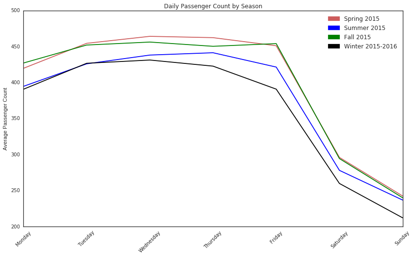
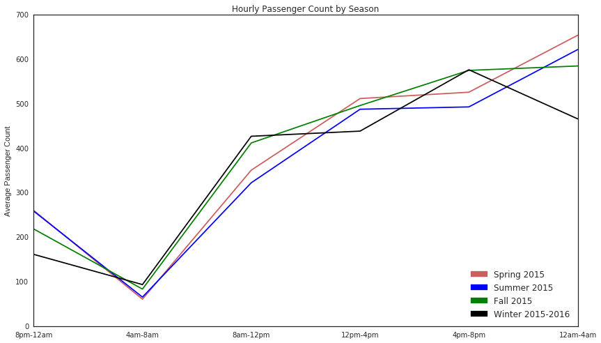
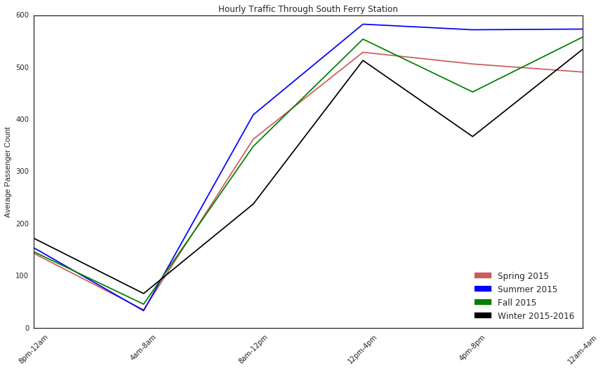

#Advertising Optimization Model Proposal#

Attn. President of the MTA:

What if there were a way to optimize subway advertising revenue down to the minute with no work for the MTA? New Yorkers know when their subway station is going to be crowded, but sifting through all the available data is a real hassle. 
Adbros, Inc has developed an advertising model that we think would be of great interest to the Metropolitan Transportation Authority.

####How it Works###
Traditional advertising models can't predict unusually popular times and they require active management. On the other hand, our digital screens will change as often as the flow of passengers moves through each station - no constant installation required. 

Advertisers visit our internet portal www.getyradhere.com and select criteria from dropdown menus that informs the maximum amount they are willing to pay to run their ads. As passengers enter and exit the turnstiles, the 'bid price' for each ad increases, and the revenue increases dramatically. 

Our model will respond as it is implemented. In addition to the preset ad costs, the pricing will change dynamically as we respond to advertiser interest - more revenue with less meetings. It is also integrated with the social media to collect impressions and historic census data, so inappropriate ads will not be a problem.

####Our Findings
We have analyzed the traffic at each station by several different factors that will affect potential pricing structure. For example, we have the seasonal traffic by day:

By hour:

We also have the differences for each station, so we can account for traditional tourist stops such as South Ferry Station:

And also traditional commuter stops, such as Penn Station:

####Low Hassle, Low Cost, Huge Rewards####
The initial cost of our model is the purchase and installation of our digital screens throughout the subway system. While the digital screens are initially more costly than print ads, they will more than pay for themselves within months based on the constant revenue of our model. 

##Why Choose Us##
It is clear to us after researching your system that MTA advertising is both a huge opportunity and a huge hassle for the MTA. With hundreds of stations and lines, changing the ads and knowing the appropriate pricing for each ad is nearly impossible without a model like ours. _Maximize your profits_: Let the advertisers come to _you_, and let us do the heavy lifting while you reap the rewards.
